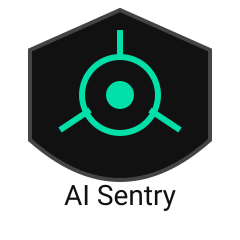

<p align="center">
  
</p>

<h1 align="center">AI Sentry</h1>
<p align="center">AI Agent Reliability OS — Trace · Replay · Policy Engine</p>
🧠 AI Sentry — AI Agent Reliability OS

> **觀測、模擬、解釋、預測、攔截、治理 AI Agent 行為的作業系統**

AI Sentry 不是 SDK、不是監控工具、不是 CI 工具。  
它是一套 **AI 行為作業系統（AI Behavior OS）**，能讓你：

- 🔍 觀測 AI Agent 的每一步行為
- 🧪 模擬未來可能的行為
- 📖 解釋失敗的根本原因
- 🔮 預測變更帶來的影響
- 🛡️ 在執行前攔截危險行為
- 📜 用 Policy DSL 定義治理規則
- ⏪ 完整重播任何 session
- 🕸️ 建立因果圖譜

---

## 🎯 一句話說明白

> **Datadog + Sentry + Kubernetes Control Plane，但是給 AI Agent 用的。**

---

## 📦 功能總覽

```

SDK → Event Store → Graph Engine → Simulation Engine
→ Policy DSL → Execution Compiler → Control Plane
→ Replay UI → Dashboard

```

| 層級 | 功能 | 說明 |
|------|------|------|
| 觀測層 | SDK + Replay + Explanation | 自動追蹤、重播、解釋 AI 行為 |
| 模擬層 | Sandbox + CI/CD | 預演變更、自動生成對抗測試 |
| 安全層 | WASM Kernel + Decision Engine | 沙箱隔離、ALLOW/WARN/BLOCK 判決 |
| 分散式層 | Event Bus + Worker Fleet | 事件驅動、水平擴展 |
| 治理層 | Policy DSL + Control Plane | 自訂規則、pause/resume/block |
| 因果層 | Graph Engine + Global Memory | 因果圖譜、跨 session 記憶 |
| 編譯層 | Execution Compiler + Stability | 把規則編譯成可執行的安全計畫 |

---

## 🚀 Quickstart

```bash
npm install ai-sentry
```

```ts
import { init, trace } from 'ai-sentry';

init({ apiKey: process.env.AI_SENTRY_KEY });

await trace({
  sessionId: 'sess-1',
  payload: {
    tool: 'search',
    input: 'weather in Tokyo',
  },
});
```

---

📜 Policy DSL（YAML）

```yaml
version: "1.0"

rules:
  - id: block-email
    priority: 100
    when:
      event.payload.tool: "email"
    then:
      action: "BLOCK"

  - id: quarantine-high-risk
    priority: 80
    when:
      event.payload.riskScore > 0.8
    then:
      action: "QUARANTINE"
```

---

🧪 CI/CD 整合

```yaml
# .github/workflows/ai-sentry.yml
name: AI Sentry Simulation
on: [pull_request]
steps:
  - run: npx ai-sentry ci run
```

每次 PR 自動模擬 AI 行為變化，Block / Warn / Approve。

---

🏗 架構

```
EVENT STORE (真理來源)
     ↓
GRAPH RECONSTRUCTOR (因果圖譜)
     ↓
SIMULATION ENGINE (模擬預測)
     ↓
EXECUTION COMPILER (編譯安全計畫)
     ↓
CONTROL PLANE (執行控制)
     ↓
REPLAY UI / DASHBOARD
```

---

💰 商業模式

方案 價格 適用
Free $0/月 個人開發者
Pro $49/月 小型團隊
Team $199/月 中型公司
Enterprise 客製 銀行、醫療、合規需求

---

🗺 Roadmap

· SDK v1 + Decision Engine
· Event Sourcing + Replay
· Policy DSL + Control Plane
· Graph Engine + Causal Analysis
· Simulation Engine + CI/CD
· Execution Compiler + Stability
· Dashboard v3 + Live Replay
· Product Hunt 上線
· Multi-Agent Global Memory

---

📄 License

MIT License

---

🔗 連結

· GitHub: https://github.com/gujianting0124-tw/ai-sentry
